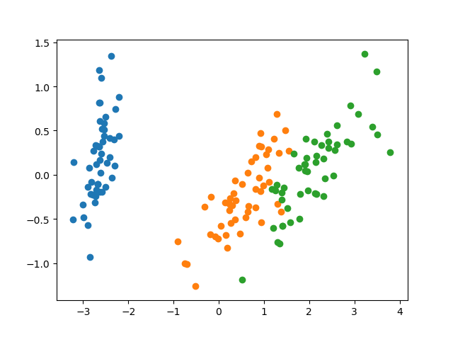
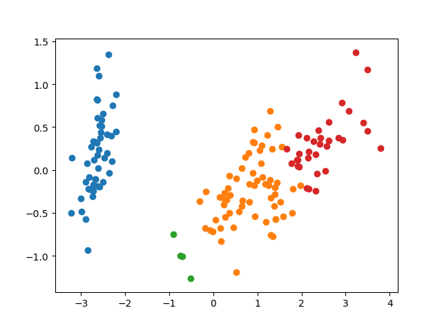

# Clusetering Schoolwork——使用马尔科夫聚类对鸢尾花数据集进行聚类
##### 河北师范大学软件学院  2016级 机器学学习方向  聚类学习课程设计
#####              王晓意  2016011642
 
# 一、设计思路
1. 聚类方法选用马尔科夫聚类方法

2. 距离度量方法运用曼哈顿距离，构筑样本集的邻接矩阵

3. 通过阈值修剪祛除链接度过低的节点连接，构成图

4. 数据集和预测结果的可视化通过matplotlib来实现

# 二、代码设计
mcl的方法的结构设计
```python
def normalize(matrix):
    #规范化矩阵
    #matrix 输入矩阵， return 规范化矩阵
    return sklearn.preprocessing.normalize(matrix,norm='l1',axis=0)

def inflate(matrix,power):
    #inflation操作,power为设定的r值
    return normalize(np.power(matrix,power))

def expand(matrix,power):
    #expand 操作,power为设定的e值
    return  np.linalg.matrix_power(matrix,power) 

def addloops(matrix,loop=1):
    '''
    添加节点回环，去除幂值的影响
    matrix：为输入的邻接矩阵
    loop：为回环大小，默认为1
    '''
    shape=matrix.shape
    new_matrix=matrix.copy()
    for i in range(shape[0]):
        new_matrix[i,i]=loop
    return new_matrix

def converged(matrix1,matrix2):
    #检查是否收敛
    return np.allclose(matrix1,matrix2)

def iterate(matrix,e,r):
    #进行expand操作
    #e为相应的e值
    #inflate
    #r为r次幂方
    matrix=expand(matrix,e)
    matrix=inflate(matrix,r)
    return matrix

def prune(matrix,min):
    #删除概率过小的边，min为最小概率
    #同时保护每列的最大值，用不删除最大值
    pruned=matrix.copy()
    pruned[pruned<min]=0
    num_cols = matrix.shape[1]
    row_indices = matrix.argmax(axis=0).reshape((num_cols,))
    col_indices = np.arange(num_cols)
    pruned[row_indices, col_indices] = matrix[row_indices, col_indices]
    return pruned

def run_mcl(matrix,e=2,r=2,min=0.01,max_turn=15):
    ''' matrix：输入邻接矩阵
        e：expand 对应参数e值，默认为2
        r:inflate 对应参数r值，默认为2
        max_turn:最大迭代次数，默认为15次'''
    
    for x in range(max_turn):
    	#保留原矩阵备份
        matrix1=matrix.copy()
        #进行expend 和 inflate操作
        matrix=iterate(matrix,e,r)  
        #每经过一次expand 和inflate操作后调用converged函数      
        if converged(matrix1,matrix):
        #当矩阵收敛时跳出循环
            break 
    print('共经历 %d 轮迭代后获得收敛矩阵'%(x))
    return matrix
```






